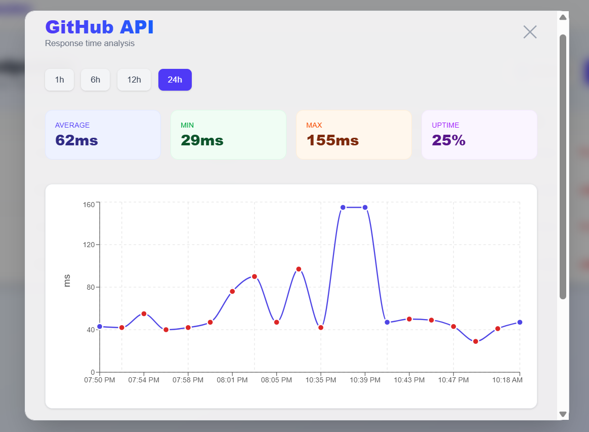
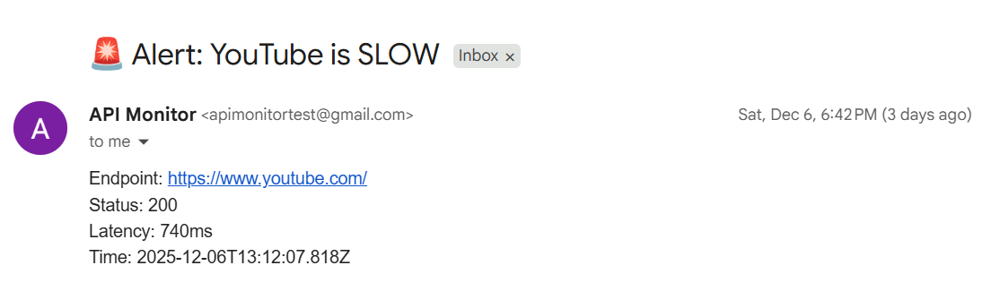

# Endpoint Monitor

A full-stack application for monitoring API endpoints, tracking uptime, response times, and sending alerts when issues are detected.

🔗 **Live Demo:** [View Project Here](https://api-monitoring-dashboard-frontend.vercel.app/)

> **Note:** This project runs on a free/hobby backend. Initial requests may experience a short delay (cold start). Please wait a few seconds or refresh if needed.

## Features

- 🔐 **User Authentication** - Secure JWT-based authentication
- 📊 **Real-time Monitoring** - Continuously check endpoints every 1-30 minutes
- 📈 **Performance Charts** - Visualize response times with interactive charts
- 🚨 **Smart Email Alerts** - Get notified when endpoints go down or become slow
- ⚡ **Auto-refresh Dashboard** - Updates every 30 seconds without manual refresh
- 📱 **Responsive Design** - Works on desktop, tablet, and mobile

## Tech Stack

### Frontend

- **Next.js 16** - React framework with App Router
- **TypeScript** - Type-safe development
- **Tailwind CSS** - Utility-first styling
- **Recharts** - Data visualization

### Backend

- **Express.js** - Node.js web framework
- **Prisma** - Type-safe database ORM
- **PostgreSQL** - Relational database
- **node-cron** - Scheduled monitoring jobs
- **JWT** - Secure authentication
- **Axios** - HTTP client for endpoint checks

### Infrastructure

- **Vercel** - Frontend hosting
- **Railway** - Backend hosting & PostgreSQL
- **GitHub** - Version control

## Architecture

```
┌─────────────┐         ┌─────────────┐         ┌──────────────┐
│   Next.js   │ ◄─────► │  Express.js │ ◄─────► │ PostgreSQL   │
│  (Frontend) │  HTTP   │  (Backend)  │  Prisma │  (Database)  │
└─────────────┘         └─────────────┘         └──────────────┘
                              │
                              │ node-cron
                              ▼
                        Monitors Endpoints
                        Every 1-30 minutes
```

## Screenshots

### Dashboard


_Real-time endpoint monitoring with status indicators_

### Response Time Chart


_Historical performance data with time range selection_

### Alerts


_Automated alerts for downtime and slow responses_

## Getting Started

### Prerequisites

- Node.js 18+ installed
- PostgreSQL database
- npm or yarn package manager

### Installation

1. **Clone the repository**

```bash
git clone https://github.com/RohanMishra47/api-monitoring-dashboard.git
cd api-monitoring-dashboard
```

2. **Install dependencies**

Frontend:

```bash
cd frontend
npm install
```

Backend:

```bash
cd backend
npm install
```

3. **Setup environment variables**

Backend `.env`:

```env
# --- Database Configuration ---
# Your database connection URL.
# Example: postgresql://[user]:[password]@[host]/[database]?sslmode=require
DATABASE_URL="postgresql://[DB_USER]:[DB_PASSWORD]@[DB_HOST]/[DB_NAME]?sslmode=require"

# --- SMTP (Email) Configuration ---
# Hostname of the SMTP server (e.g., smtp.gmail.com)
SMTP_HOST=smtp.gmail.com
# Port for the SMTP server (e.g., 587 for TLS)
SMTP_PORT=587
# The email address used to log in to the SMTP server
SMTP_USER="[SENDER_EMAIL_ADDRESS]"
# The application-specific password or secure password for the SMTP user
SMTP_PASS="[SMTP_APPLICATION_PASSWORD]"

# --- Application-Specific Settings ---
# The email address that should receive alerts
ALERT_RECIPIENT="[ALERT_RECIPIENT_EMAIL]"
# A long, random string used for signing JWTs.
# **MUST** be kept secret and should be at least 32 characters long.
JWT_SECRET="[YOUR_LONG_RANDOM_SECRET_KEY]"
```

Frontend `.env.local`:

```env
NEXT_PUBLIC_API_URL="http://localhost:5000"
```

Frontend `.env.production`:

```env
NEXT_PUBLIC_API_URL="Your deployed backend URL"
```

4. **Setup database**

```bash
cd backend
npx prisma migrate dev
npx prisma generate
```

5. **Run the application**

Backend:

```bash
cd backend
npm run dev
```

Frontend:

```bash
cd frontend
npm run dev
```

6. **Open your browser**

- Frontend: http://localhost:3000
- Backend: http://localhost:5000

## Usage

1. **Register an account** at `/register`
2. **Login** at `/login`
3. **Add an endpoint** by clicking "+ Add Endpoint"
   - Enter endpoint name (e.g., "Production API")
   - Enter URL (e.g., "https://api.example.com/health")
   - Set check interval (1, 5, 15, or 30 minutes)
   - Set response time threshold for alerts
4. **Monitor status** on the dashboard
   - 🟢 Green = Up and healthy
   - 🔴 Red = Down or error
5. **View charts** by clicking "View Chart" on any endpoint
   - See response time trends
   - Switch between 1h, 6h, 12h, 24h views
   - Track uptime percentage

## API Endpoints

### Authentication

- `POST /api/auth/register` - Create new account
- `POST /api/auth/login` - Login to existing account

### Endpoints Management

- `GET /api/endpoints` - Get user's endpoints
- `POST /api/endpoints` - Create new endpoint
- `DELETE /api/endpoints/:id` - Delete endpoint
- `PATCH /api/endpoints/:id` - Update endpoint

### Monitoring Data

- `GET /api/endpoints/:id/logs` - Get monitoring logs
- `GET /api/alerts` - Get active alerts

## How Monitoring Works

1. **Background Job:** A cron job runs every minute in the backend
2. **Check Due Endpoints:** Identifies endpoints due for checking based on their interval
3. **HTTP Request:** Makes HTTP GET request to each endpoint URL
4. **Record Results:** Stores status code, response time, and any errors in database
5. **Alert Logic:**
   - Creates alert if endpoint is down (status code 0 or ≥500)
   - Creates alert if response time exceeds threshold
   - Resolves alert when endpoint recovers
6. **Frontend Display:** Dashboard fetches latest logs and displays current status

## Project Structure

```
endpoint-monitor/
├── frontend/
│   ├── app/
│   │   ├── components/
│   │   │   └── EndpointChart.tsx
│   │   ├── dashboard/
│   │   │   └── page.tsx
│   │   ├── login/
│   │   │   └── page.tsx
│   │   ├── register/
│   │   │   └── page.tsx
│   │   └── page.tsx
│   └── package.json
│
├── backend/
│   ├── routes/
│   │   ├── auth.ts
│   │   └── endpoints.ts
│   ├── middleware/
│   │   └── authMiddleware.ts
│   ├── services/
│   │   └── monitoring.ts
│   ├── prisma/
│   │   └── schema.prisma
│   └── index.ts
│
└── README.md
```

## Future Enhancements

If this were a production application, potential next features could include:

- [ ] Slack/Discord webhook integrations
- [ ] Team collaboration and role-based access
- [ ] Public status pages
- [ ] Multi-region monitoring
- [ ] Incident reports and post-mortems
- [ ] API rate limiting and usage analytics

**Note:** This project demonstrates core monitoring functionality as an MVP. Additional features would be prioritized based on user feedback in a real product scenario.

## Contributing

This is a portfolio project, but feedback and suggestions are welcome! Feel free to open an issue or reach out.

## License

MIT License - feel free to use this project for learning or your own portfolio.

## Contact

### 🔗 Connect with Me

- **GitHub:** [RohanMishra47](https://github.com/RohanMishra47)
- **LinkedIn:** [Rohan Mishra](https://www.linkedin.com/in/rohan-mishra-6391bb372/)
- **X (Twitter):** [@RohanMishr19102](https://x.com/RohanMishr19102)
- **Email:** mydearluffy093@gmail.com

---

Built with ❤️ as a portfolio project to demonstrate full-stack development skills.
